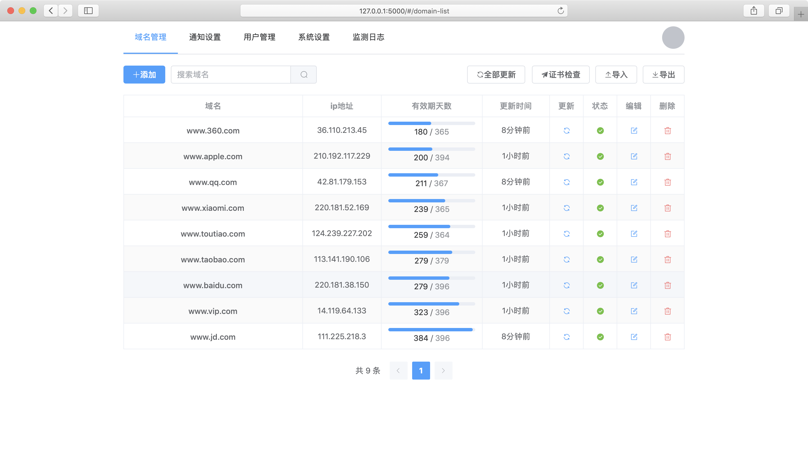

# Domain Admin

基于Python + Vue.js 技术栈的域名管理控制台

安装

```bash
$ pip install domain_admin

# 启动运行
$ python -m domain_admin.main
```

## 项目简介

- https://gitee.com/mouday/domain-admin
- https://github.com/mouday/domain-admin
- https://pypi.org/project/domain-admin/

项目截图



功能：

- 域名证书信息查询
- 监控域名证书信息，到期提醒
- api接口 浏览器 桌面 移动端（app+小程序）
- 用户登录
- 域名导入，导出功能


前端选型

- node.js v16.15.1
- vue3.js
- quasar + electron

后端选型

- Python3.7.0
- Flask
- jinja2 https://jinja.palletsprojects.com/en/3.1.x/
- peewee http://docs.peewee-orm.com/en/latest/index.html#
- apscheduler https://apscheduler.readthedocs.io/en/3.x/
- supervisord http://supervisord.org/index.html

## 二次开发

接口文档：[/doc/index.md](/doc/index.md)

```bash
git clone https://github.com/mouday/domain-admin.git

# 安装依赖
pip install -r requirements.txt

# 启动开发服务
python dev.py
```

> 注意：后端服务依赖 `curl`

代码推送

```bash
# github
git push -u origin master

# gitee
git push -u gitee master
```

## 配置文件 

可以在运行目录添加配置文件 `config.yml`

支持的参数

```yaml
# ###### 服务器配置 #######

# 服务器地址
FLASK_HOST: '127.0.0.1'

# 服务器端口
FLASK_PORT: 5000

# 定时检测时间 分 时 日 月 周，默认每天上午 10: 30 检测
SCHEDULER_CRON: "30 10 * * *"


# ###### 邮箱配置 #######

# 服务器地址
MAIL_HOST: "smtp.163.com"
# 服务器端口 25 或者 465(ssl)
MAIL_PORT: 465

# 发件人邮箱账号
MAIL_USERNAME: "demo@163.com"
# 发件人邮箱密码
MAIL_PASSWORD: "xxx"


# ###### 账号权限配置 #######

# token key
SECRET_KEY: "xxx"

# token 有效期 7 天
TOKEN_EXPIRE_DAYS: 7

# 管理员账号
ROOT_USERNAME: 'root'

# 管理员密码
ROOT_PASSWORD: '123456'

```